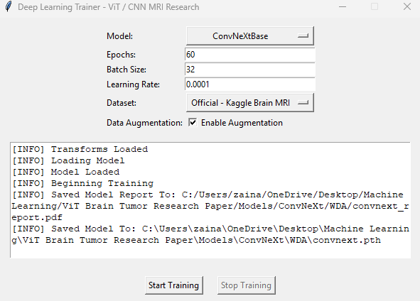
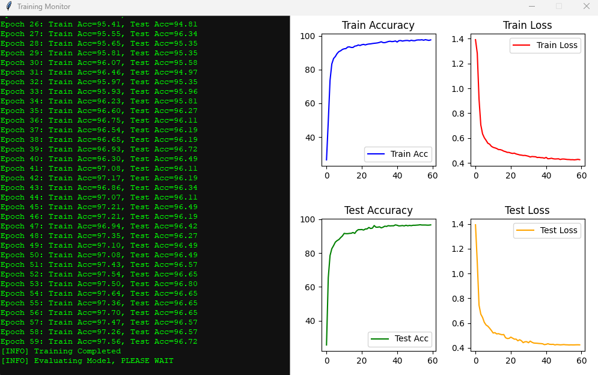
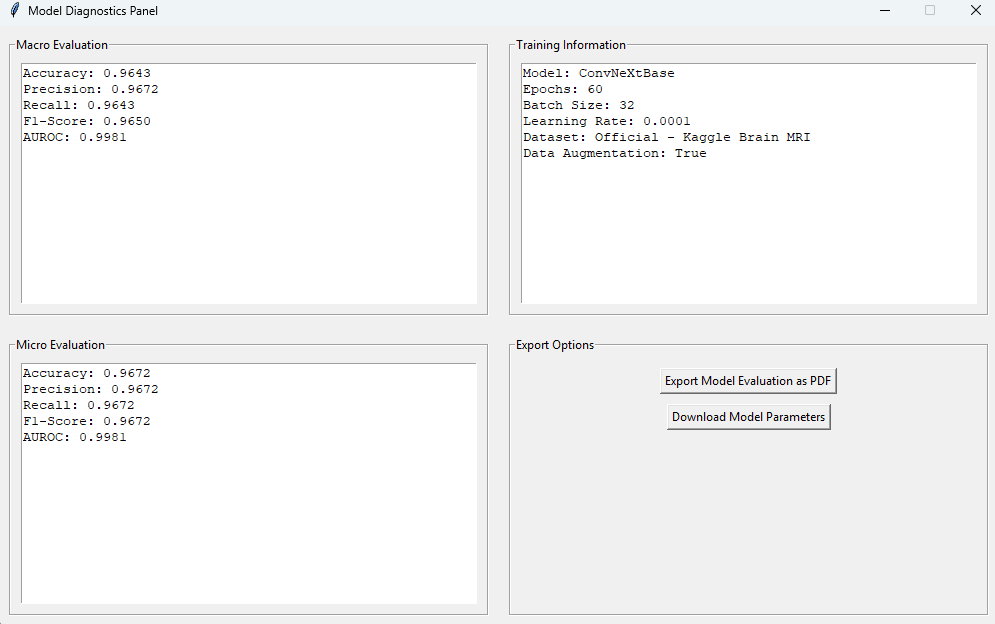

A Comparative Evaluation of CNN and VisionTransformer Architectures for Brain Tumor Detection in MRI Scans

This repository contains all code, models, and materials for the research project titled **"A Comparative Evaluation of CNN and Vision Transformer Architectures for Brain Tumor Detection in MRI Scans
"**. The study evaluates the performance of convolutional neural networks (CNNs) and Vision Transformers (ViTs) in classifying various brain MRI scans for the detection of tumors. 

---

## Project Summary

This study evaluates the performance of convolutional neural networks (CNNs) and Vision Transformers (ViTs) in classifying various brain MRI scans for the detection of tumors. Model series such as EfficientNet, ConvNeXt, ViT, and SwinTransformer were trained on a publicly
available multiclass brain tumor dataset. To support experimentation and reproducibility, a custom GUI-based deep learning software was developed, enabling users to train models, configure parameters, apply data augmentation, monitor performance metrics, and generate diagnostic reports. A comparative analysis was conducted using accuracy, precision, recall, F1-score, AUROC, and confusion matrices. Results showed that ViT-B/16, EfficientNetB0, and ViT-B/32
achieved test accuracies of over 98 %. ViT-B/16 performed the best overall, demonstrating that larger model capacity and reduced patch size enhance feature extraction in brain MRI classification. EfficientNetB0 delivered strong performance despite its reduced complexity, demonstrating the strength of CNNs and the potential of transformer-based architectures for detecting brain tumors.


---

## Large Files / Git LFS
This repository uses Git Large File Storage (LFS) to manage large files such as trained model weights. 

**IMPORTANT:** Before cloning, make sure Git LFS is installed, otherwise large files will not download properly. 

---
## GUI / Training Interface
The training interface is the ```gui.py``` file, it is a simple intuitive platform allowing for easy model training and evaluation. More can be learned about the interface by going to ```paper/paper.pdf```

<p align="center">
  
  
  
</p>

## Dataset

The [Kaggle Brain Tumor MRI Dataset](https://www.kaggle.com/datasets/masoudnickparvar/brain-tumor-mri-dataset) was used, containing T1-weighted contrast-enhanced images with labeled tumor types.

More details in `dataset_info.txt`.

> **Note:** The dataset is not included in this repo. The dataset can either be downloaded through the link above and then unzipped and placed in a folder named ```data```. Additionally, training interface (```gui.py```) can automatically download the dataset in the local filespace. 

---
## Repository Layout

```
brain-mri-classifier/
├── model_reports/
│  ├── model_reports/
│  │   ├── ConvNeXt_Base/
│  │   │   ├── NDA/
│  │   │   └── WDA/
│  │   └── ViT/...
│  └── diagnostics/
│      ├── diagnostics.png
│      ├── selection.png
│      └── traininglog.png

├── models/                
│  ├── ConvNeXt_Base/
│  │   ├── NDA/
│  │   └── WDA/
│  ├── EfficientNet/
│  │   ├── EfficientNetB0/{NDA,WDA}
│  │   ├── EfficientNetB5/
│  │   └── EfficientNetB7/
│  ├── SwinTransformer_Base/
│  └── ViT/
│      ├── ViT-B16/
│      └── ViT-B32/

├── paper/
│  ├── figures/
│  │   ├── conf_mat_v2.png
│  │   └── ...
│  ├── paper.tex
│  ├── references.bib
│  └── paper.pdf

├── screenshots/
│  ├── diagnsotics.png
│  ├── selection.png
│  └── traininglog.png

├── gui.py                         
├── dataset_info.txt
├── requirements.txt
├── .gitattributes
└── README.md

```


---

## Installation

### Clone the repository
```bash
git clone https://github.com/zaina-ml/brain-mri-classifier
cd brain-mri-classifier
git lfs pull
